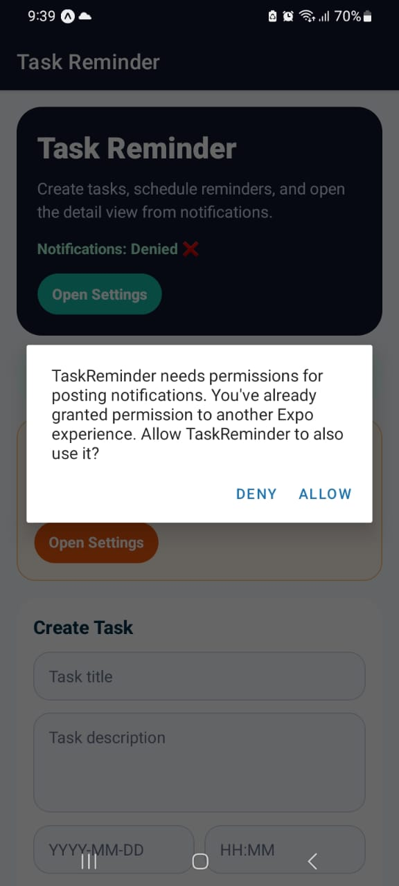
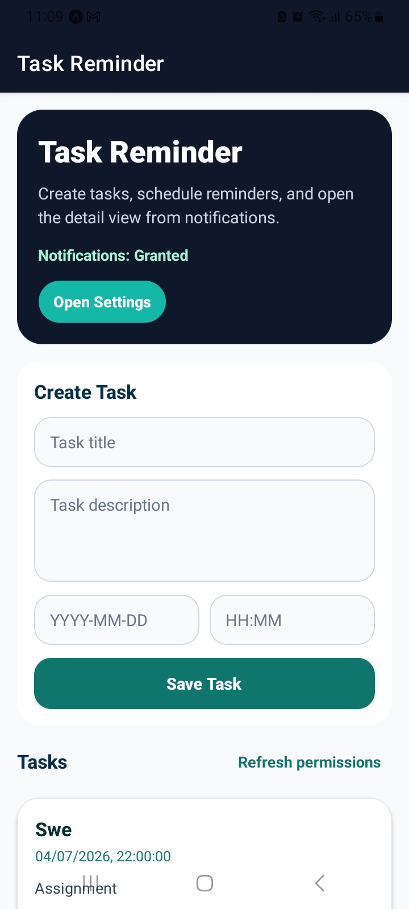
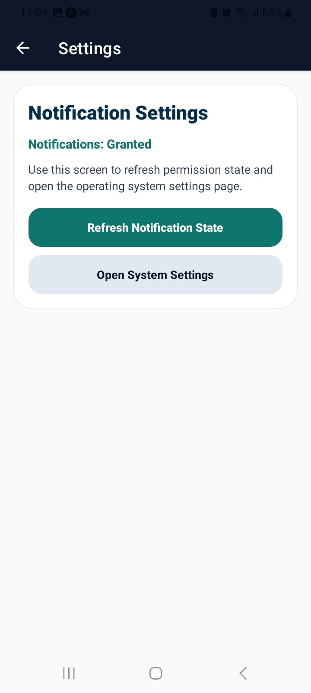
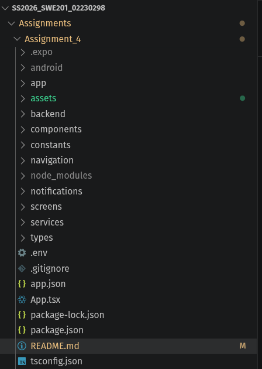

# Task Reminder

A feature rich React Native (Expo) application that helps users manage tasks and receive timely notifications before their due dates. This project demonstrates best practices for handling local and remote push notifications in a mobile environment, with a complete backend service for managing notification delivery.

## Overview

**App Purpose:** Task Reminder is designed to help users stay organized by managing a list of tasks and receiving intelligent notifications at the right time. Whether you're juggling work deadlines, personal projects, or everyday chores, this app ensures you never miss an important task.

**Key Scenario:** A user creates a task with a specific due date and time. The app automatically schedules a notification to alert them 10 minutes before the deadline. Users can optionally enable remote push notifications from the backend for more robust delivery. When a notification arrives, tapping it navigates directly to the task details, creating a seamless workflow.

## App Screenshots

### Notification in System Tray
Task Reminder notification appearing in the Android system tray


### Permission Request Dialog
Permission request dialog asking user to allow notifications


### Home Screen – Task List & Creation
Home screen showing task creation form and task list with notifications granted


### Settings Screen – Notification Settings
Settings screen showing notification permission status and controls


### Task Details Screen
Task details screen showing task info and reminder toggle

---

## Features

### Notification Types

- **Local Scheduled Reminders:** Automatically scheduled for 10 minutes before a task's due date using the device's local notification system.
- **Remote Push Notifications:** Server-triggered notifications delivered via Expo's push service, allowing notifications even when the app is backgrounded.

### Notification Handling

- **Foreground Handling:** When the app is in the foreground, notifications appear with sound and vibration, with smart banner management.
- **Background Handling:** Notifications are reliably delivered when the app is closed or backgrounded, with persistent system tray display.
- **Tap Navigation:** Tapping a notification automatically navigates the user to the relevant task detail screen, providing context and immediate action.

### Permission Management

- Comprehensive permission checking at app startup.
- User-friendly permission banners that guide users to grant notification access.
- Clear status indicators showing current permission state (Granted, Denied, or Not Requested).
- Graceful fallback behavior when permissions are denied.

### Task Management

- Create, view, edit, and delete tasks.
- Set specific due dates and times for each task.
- Toggle notification enabling/disabling per task.
- Tasks are sorted by due date for quick prioritization.
- Persistent storage of tasks on the device using AsyncStorage.

---

## Technology Stack

### Frontend

- **Framework:** React Native with Expo SDK 54.0.0
- **Navigation:** React Navigation (native stack)
- **State Management:** React Hooks + Local Storage
- **Notifications:** Expo Notifications (`expo-notifications` v0.31.5)
- **Storage:** AsyncStorage (`@react-native-async-storage/async-storage` v2.1.2)
- **Language:** TypeScript

### Backend

- **Framework:** Express.js v4.21.2
- **Language:** TypeScript with Node.js
- **External Service:** Expo Push Service API
- **Storage:** JSON file-based (for demo/development)
- **Middleware:** CORS, JSON body parser
- **Port:** Configurable via environment (default: 3000)

---

## Project Structure


---

## Installation & Setup

### Prerequisites

- **Node.js:** v16 or higher
- **npm or yarn:** Latest version
- **Expo CLI:** Install globally with `npm install -g expo-cli`
- **Android Studio** (for Android builds) or **Xcode** (for iOS builds)
- **Java Development Kit (JDK):** For Android development

### Step 1: Install Frontend Dependencies

```bash
# Navigate to the project root
cd task-reminder

# Install dependencies
npm install
# or
yarn install
```

### Step 2: Install Backend Dependencies

```bash
cd backend
npm install
# or
yarn install

cd ..
```

### Step 3: Configure Environment Variables

Create a `.env` file in the `backend/` directory:

```env
PORT=3000
API_SECRET_KEY=your-secret-key-here
```

Create a `.env` file in the project root (optional, for Expo environment):

```env
EXPO_PUBLIC_API_BASE_URL=http://localhost:3000
EXPO_PUBLIC_API_KEY=your-secret-key-here
```

### Step 4: Run the Backend

In one terminal window, start the backend server:

```bash
npm run backend
```

You should see output like:

```
Task Reminder backend running on PORT 3000
```

Test the backend health:

```bash
curl http://localhost:3000/health
# Expected response: {"ok":true}
```

### Step 5: Run the Expo App

In a new terminal window, start the Expo development server:

```bash
npm start
```

This opens the Expo CLI menu. Then:

**For Android:**
```bash
# Press 'a' in the Expo menu
# or run directly:
npm run android
```

**For Web (testing only):**
```bash
npm run web
```

---


### Key Implementation Details

**Notification Setup** ([notifications/notificationSetup.ts](notifications/notificationSetup.ts)):
- Configures Expo notification handlers with sensible defaults.
- Creates Android notification channels for proper categorization.
- Handles permission requesting with graceful fallbacks.

**Event Handling** ([notifications/notificationHandlers.ts](notifications/notificationHandlers.ts)):
- Listens for foreground notifications and updates UI in real-time.
- Captures notification taps and extracts task data for navigation.
- Provides cleanup functions to prevent memory leaks.

**Local Scheduling** ([notifications/scheduleHelpers.ts](notifications/scheduleHelpers.ts)):
- Schedules notifications for 10 minutes before task due date.
- Validates reminder time to prevent scheduling in the past.
- Supports immediate notifications for testing.

**Backend API** ([backend/routes/notifications.ts](backend/routes/notifications.ts)):
- Registers and stores device push tokens.
- Integrates with Expo Push Service for reliable delivery.
- Includes API key authentication for security.

---

## Testing the Notification Flow

### Test 1: Local Reminder Notification

1. Create a task with a due date 11 minutes in the future.
2. Wait for the notification to appear 10 minutes before the due date.
3. Verify the notification appears in the system tray (background) or as a banner (foreground).
4. Tap the notification and verify it navigates to the task detail screen.

### Test 2: Remote Push Notification

1. Note your device ID from the Settings screen.
2. Register your device's push token via the `/api/register-token` endpoint.
3. Send a test notification using the `/api/send-notification` endpoint (see examples above).
4. Verify the notification arrives on your device and tap navigation works.

### Test 3: Permission Handling

1. Deny notification permissions when prompted.
2. Verify the permission banner appears on the Home screen.
3. Tap the banner to re-request permissions.
4. Grant permissions and verify the banner disappears.

---

## Troubleshooting

### Notifications Not Appearing

- **Check permissions:** Go to Settings > Apps > Task Reminder > Notifications and ensure notifications are enabled.
- **Check permission state:** The app displays the current permission state on the Home screen.
- **Device power optimization:** Some devices may block background notifications. Add the app to the battery optimization whitelist.
- **Time synchronization:** Ensure your device's time is correctly set. Scheduled notifications rely on accurate time.

### Backend Connection Issues

- **Backend not running:** Ensure the backend is running on port 3000 (`npm run backend`).
- **CORS errors:** Check that the backend includes CORS middleware (it does by default).
- **API Key mismatch:** Verify the `API_SECRET_KEY` in `.env` matches the key you're sending in requests.

### Android Build Issues

- **Gradle errors:** Run `cd android && gradlew clean build` to clean the Gradle cache.
- **SDK version mismatch:** Ensure your Android SDK version matches the `compileSdkVersion` in `android/app/build.gradle`.
- **Permission errors:** Verify `NOTIFICATIONS` and `SCHEDULE_EXACT_ALARM` are declared in `app.json`.

### App Crashes on Startup

- **Missing dependencies:** Run `npm install` to ensure all packages are installed.
- **TypeScript errors:** Run `npx tsc --noEmit` to check for type issues.
- **AsyncStorage issues:** Ensure `@react-native-async-storage/async-storage` is installed.

---


## Dependencies Summary

### Frontend

| Package | Version | Purpose |
|---------|---------|---------|
| react-native | 0.81.4 | Mobile UI framework |
| expo | ~54.0.0 | Managed React Native framework |
| expo-notifications | ~0.31.5 | Notification handling |
| @react-navigation/native | ^7.0.14 | Screen navigation |
| @react-native-async-storage/async-storage | ^2.1.2 | Persistent local storage |
| typescript | ~5.8.3 | Type safety |

### Backend

| Package | Version | Purpose |
|---------|---------|---------|
| express | ^4.21.2 | Web server framework |
| cors | ^2.8.5 | Cross-origin request handling |
| dotenv | ^16.6.1 | Environment variable management |
| typescript | ^5.8.3 | Type safety |

---

