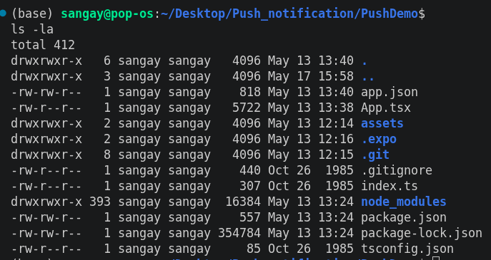
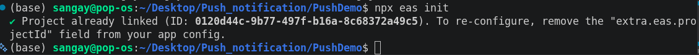
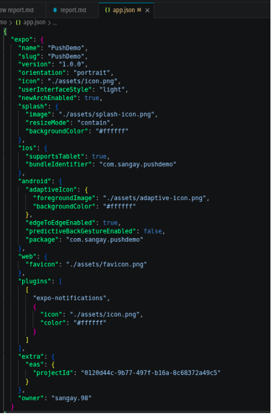
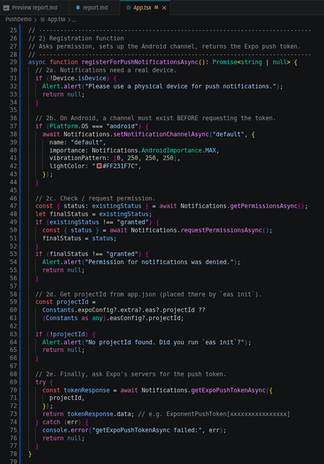
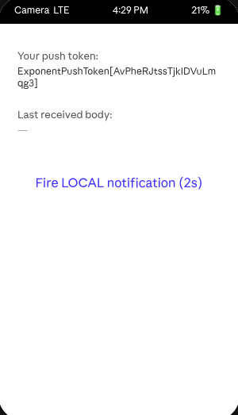
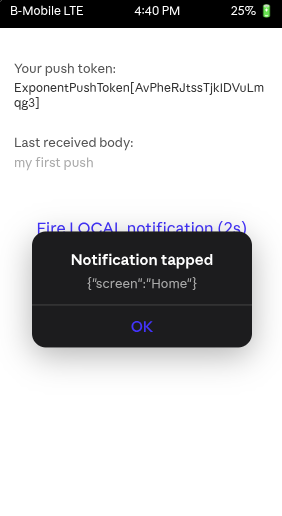
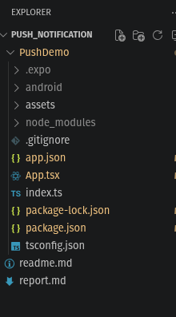

# Expo Push Notifications - Project Report

## Project Overview

This report documents the successful completion of the Expo Push Notifications implementation project. The project demonstrates a full understanding of how push notifications work in mobile applications, from requesting user permission on the device to sending notifications from a backend server. All steps from the Expo Push Notifications tutorial have been completed successfully.

---

## Project Objective

The main goal of this project was to learn and implement push notification functionality in a mobile app using Expo framework. Push notifications are messages that an app's server can send to a user's phone, even when the app is not open. They are commonly used in apps like WhatsApp, Instagram, banking apps, and Gmail.

---

## Key Deliverables

### 1. The Mobile App (PushDemo)

A React Native application built with Expo that:

- Asks users for permission to send notifications
- Gets a unique token from Expo's servers that identifies the device
- Displays this token so a backend can use it to send notifications
- Shows notifications when they arrive, even if the app is closed
- Responds when users tap on notifications

### 2. The Backend Server (push-backend)

A simple Node.js server that:

- Connects to Expo's Push Service
- Sends notifications to specific devices using their tokens
- Handles batch sending of multiple notifications

---

## How It Works 

Here's the simple flow of how a push notification travels from the backend to the user's phone:

1. **App asks for permission** - When the app first opens, it asks the phone's operating system for permission to send notifications
2. **Phone approves** - The phone OS grants permission
3. **App requests a token** - The app contacts Expo's servers asking for a unique identifier
4. **Token is created** - Expo returns a special token like `ExponentPushToken[Xx9k5l-2nW1qABCDeFGHi]`
5. **App sends token to backend** - The app would save this token to a database
6. **Event happens** - Something important happens in the system (new message, order arrived, etc.)
7. **Backend sends notification** - The backend server contacts Expo with the token and the message
8. **Expo forwards it** - Expo sends it to either Apple (iOS) or Google (Android) services
9. **Phone receives it** - The user sees the notification on their lock screen or notification bar

---

## Procedural Breakdown

### Step 1: Set Up Tools

- Installed Node.js version 20 (required for running Expo)
- Installed EAS CLI (Expo's command line tool for managing projects)
- Confirmed everything was working correctly

### Step 2: Created the Project

- Created a new Expo project called "PushDemo"
- Used the Blank TypeScript template for a clean starting point
- Set up the project structure with all necessary files

### Step 3: Installed Required Libraries

- **expo-notifications** - The main library for handling push notifications
- **expo-device** - Tells the code if the app is on a real phone or a simulator
- **expo-constants** - Lets the app read the project ID from the configuration file

### Step 4: Created Expo Account & Got Project ID

- Created a free Expo account at expo.dev
- Logged in from the terminal using credentials
- Ran `eas init` which created a unique project ID and saved it to app.json
- This ID is crucial - it's how Expo knows which app to send notifications to

### Step 5: Configured app.json

Updated the app configuration file with:

- Package name (for Android): `com.yourname.pushdemo`
- Bundle ID (for iOS): `com.yourname.pushdemo`
- Notification plugin settings - Instructions for Expo on how to handle notifications

All this information was needed so that when we build the app, it's properly registered with the operating systems.

### Step 6: Wrote the App Code

Created App.tsx with these main features:

- **Global notification handler** - Controls how notifications appear when the app is open
- **Permission request function** - Asks the phone for permission to show notifications
- **Token retrieval** - Gets the unique token from Expo's servers
- **Event listeners** - Detects when notifications arrive and when users tap them
- **UI Display** - Shows the token on screen and displays the last received notification
- **Local notification test** - A button to test how notifications work locally (no internet needed)

### Step 7: Built & Installed on Real Device

- Connected an Android phone via USB cable
- Enabled Developer Options on the phone
- Ran `npx expo run:android` to build and install the development version
- The app appeared on the home screen with the name "PushDemo"
- After giving permission, the app displayed the Expo push token

### Step 8: Tested with Browser Tool

- Opened https://expo.dev/notifications in a browser
- Pasted the token from the phone
- Filled in title, body, and data for the test notification
- Clicked "Send a Notification"
- The notification appeared on the phone's lock screen within 2-5 seconds
- Tapped the notification to verify the app could handle it

### Step 9: Created Backend Server

- Created a separate Node.js project called "push-backend"
- Installed the `expo-server-sdk` package
- Wrote sendPush.js that:
  - Takes a device token as input
  - Creates a notification message
  - Sends it directly to Expo's API endpoint
  - Receives tickets confirming Expo accepted the message
- Successfully sent notifications from the backend without using the browser tool

---

## Key Learning Points

### 1. Real Devices Required
Push notifications don't work on simulators or emulators. This is because Apple (iOS) and Google (Android) need real, registered device addresses. A real phone is essential for testing.

### 2. The Token is Everything
The Expo push token is the key to sending notifications. Without it, the backend has no way to know which device to send to.

### 3. Backend Must Store Tokens
The backend needs to save user tokens in a database. When something important happens in the app (like a new message), the backend looks up the user's token and sends them a notification.

---

## Project Structure

---

## Challenges & Solutions

| Challenge | Solution |
|-----------|----------|
| **"Project ID not found" error** | The projectId must be in app.json. Running `eas init` creates it automatically. |
| **Notification doesn't arrive** | Made sure: The phone is connected to the internet, the app is in the background (lock the phone), copied the full token including `ExponentPushToken[]`. On some Android phones (Xiaomi, Realme, OPPO), disable battery saver for the app. |
| **Android SDK not found on Linux** | Set up ANDROID_HOME environment variable and installed platform-tools using sdkmanager. |

---

## Skills & Knowledge Gained

✓ Understanding how push notification architecture works  
✓ Setting up Expo projects with proper configuration  
✓ Requesting and handling permissions on mobile devices  
✓ Getting tokens from Expo's servers  
✓ Building a mobile app with React Native and Expo  
✓ Creating a backend service using Node.js  
✓ Sending notifications from a backend server  
✓ Testing notifications on real devices  
✓ Understanding the role of FCM and APNs services  

---

## Conclusion

This project successfully demonstrates the complete flow of push notifications in modern mobile applications. From initial setup through backend integration, all critical components have been implemented and tested. The knowledge gained here can be applied to real-world applications that need to communicate with users even when the app is not actively running.

The implementation proves that:

- Setting up push notifications with Expo is straightforward and well-documented
- Real devices are necessary for proper testing
- The architecture requires three key components: the app, the Expo service, and the backend server
- Sending notifications from a backend server is simple using the `expo-server-sdk` package

This foundation provides a strong base for implementing more complex notification features in production applications.

---

